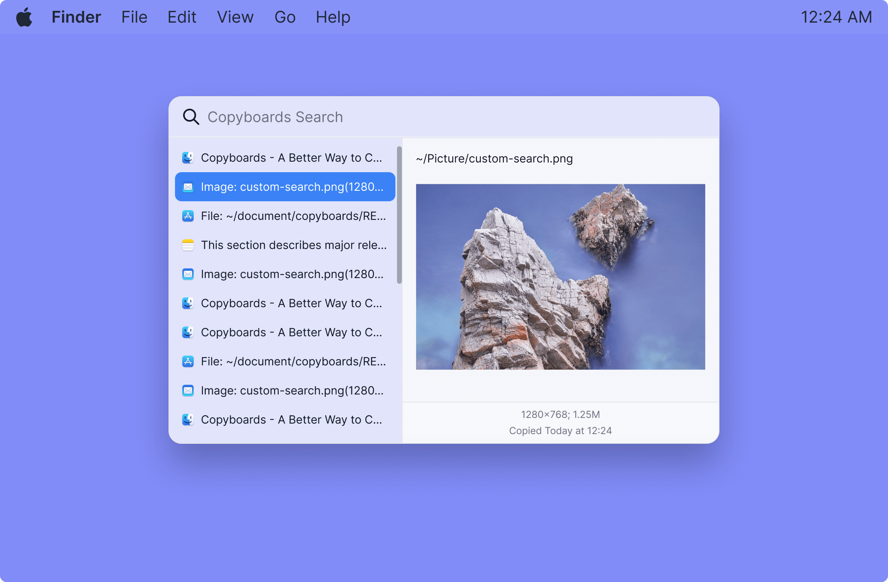

# Copyboards

A searchable clipboard history application for copy and paste, inspired by [Alfred Clipboard History](https://www.alfredapp.com/help/features/clipboard), build with [Electron](https://www.electronjs.org/), [Vue.js 3](https://vuejs.org/) and [tailwindcss](https://tailwindcss.com/).

With Copyboards, you don't worry about text, images and file links you've copied but forget to paste earlier. It's all there in your searchable history.

## Documentation

For more information, please check our official documentations.

## What's Next

You can check our [Copyboards TODO](https://github.com/users/logeast/projects/3/views/1) project page to know what's on the plan.

You can alse check [milestones](https://github.com/logeast/copyboards/milestones) to know what's being worked on.

## Community

Welcome to join our [Discussions](https://github.com/logeast/Copyboards/discussions).

## Contributing

Follow our contribution guide to learn how to contribute to Copyboards.

## Contributor

## Sponsors

If you like this project, please consider fund me to help the maintenance.

## License

[MIT License](./LICENSE) Copyright (c) 2022 Logeast.
