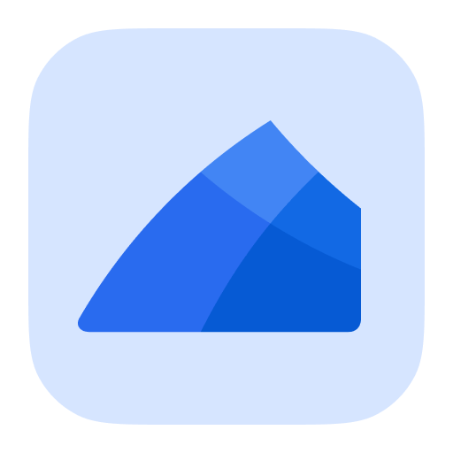
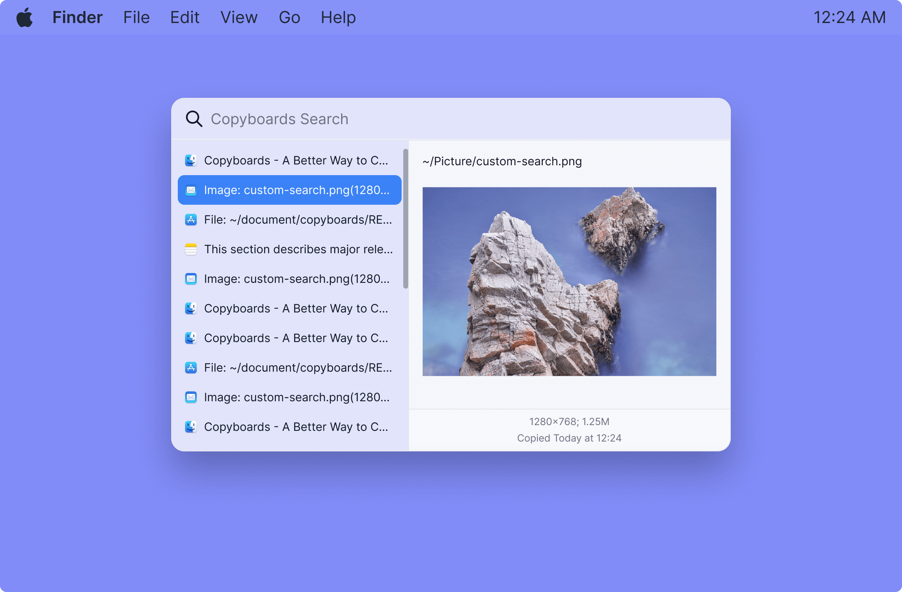

# Copyboards

Copyboards is a searchable clipboard history application for copy and paste. It is written in [Tauri](https://tauri.studio/), [Vue.js 3](https://vuejs.org/) and [tailwindcss](https://tailwindcss.com/).

With Copyboards, you don't worry about text, images and file links you've copied but forget to paste earlier. It's all there in your searchable history.

## Where can I get it

Download the official installer for your operating system:

- [macOS](https://github.com/logeast/Copyboards/releases)
- [macOS (Apple silicon)](https://github.com/logeast/Copyboards/releases)
- [Windows](https://github.com/logeast/Copyboards/releases)

If you are a designer and interested in the Copyboards' desgin assets. You can find it from [this figma file](https://www.figma.com/file/FQ91Yef5UzSedNVS2rYjQ0/%F0%9F%8C%88-Copyboards---A-Searchable-Clipboard-History-for-Copy-and-Paste?node-id=247%3A4751).

## What's Next

You can check our [Copyboards TODO](https://github.com/users/logeast/projects/3/views/1) project page to know what's on the plan.

You can alse check [milestones](https://github.com/logeast/copyboards/milestones) to know what's being worked on.

## Community

Welcome to join our [Discussions](https://github.com/logeast/Copyboards/discussions).

## Contributing

Follow our contribution guide to learn how to contribute to Copyboards.

## Sponsors

If you like this project, please consider fund me to help the maintenance.

## License

[MIT License](./LICENSE) Copyright (c) 2022 [Logeast](https://github.com/logeast). All rights reserved.

## Trademark

"Copyboards" and the Copyboards logo are trademarks. See the [TRADEMARK.md](TRADEMARK.md) file for details.
